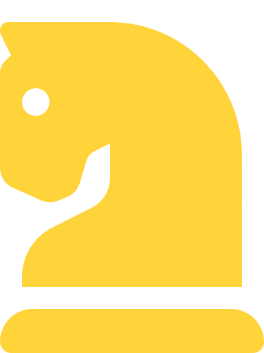
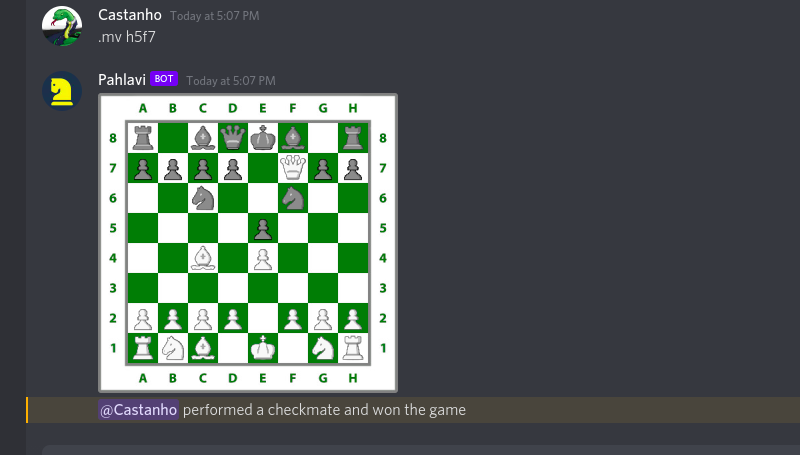

  
  <h2 align="center">PAHLAVI</h2>
  <h6 align="center">Chess bot for Discord, written in Java, using chesslib, JDA and AWT</h6>

### About

  

PAHLAVI is a Discord bot, written in Java with JDA, to play chess via notation through text channels. You can use `.ce @user` to challenge a human user on the server

The players' side will be randomly drawn. You can use commands like `.mv e2e5` to move pieces, where the first part is the start position and the second part is the desired destination

This bot supports all possible chess moves including promotions and castling, thanks to [chesslib](https://github.com/bhlangonijr/chesslib)

After each move this will generate an image of the current state of the board and send it to the channel where the game takes place in

Each challenge will start its own event listener

### Technologies

- [chesslib](https://github.com/bhlangonijr/chesslib)
- [Java](https://www.oracle.com/java/)
- [JDA](https://github.com/DV8FromTheWorld/JDA)

### Use

- `.ce` followed by a mention to challenge a user
- `.mv` on your turn to perform a valid move
- `.ff` on your turn to surrender

### License

All the code on this repository is licensed under the [GNU General Public License v3.0](https://www.gnu.org/licenses/gpl-3.0.en.html)